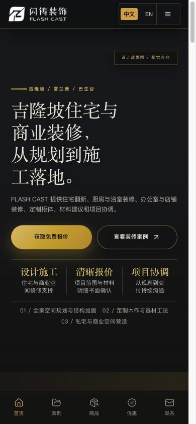
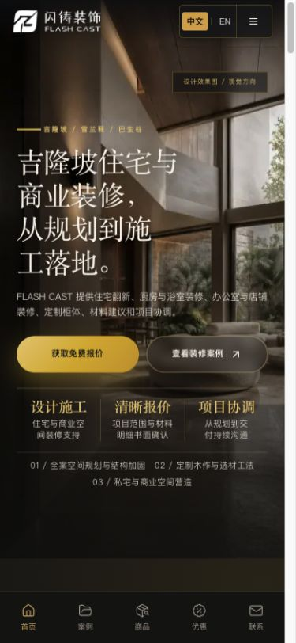
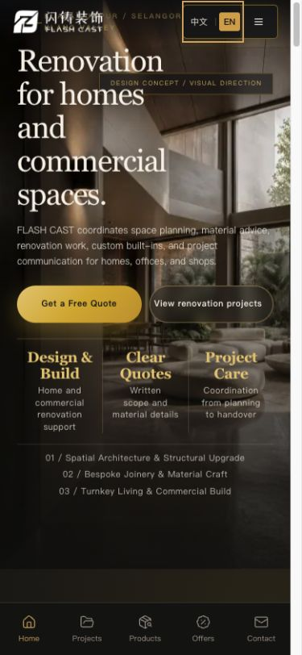
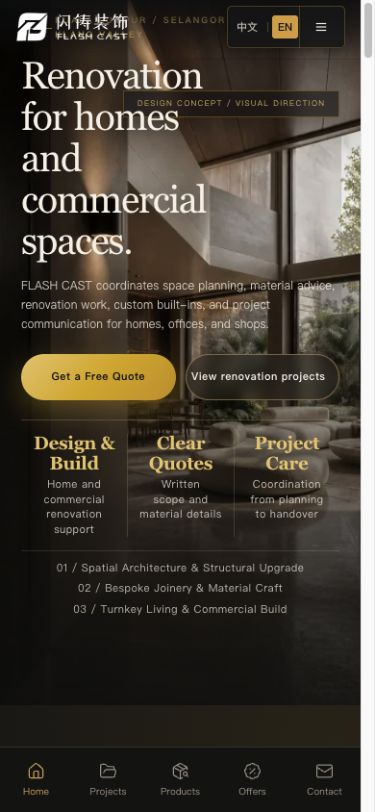
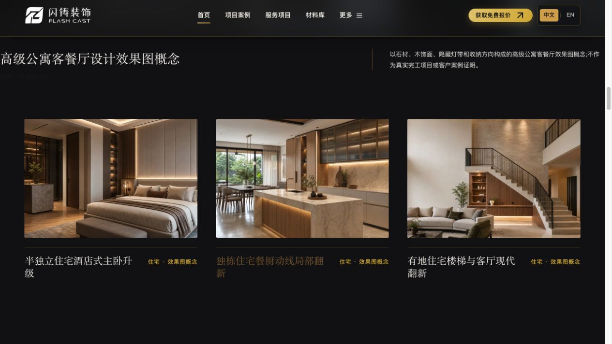

# FLASH CAST 网站设计与体验审计

审计日期：2026-08-30
审计对象：生产站 `https://flashcast.com.my` 与本地 `zhuangxiuwangzhan-main`
审计范围：首页、项目页、服务页；中文/英文；桌面与移动端；刷新、图片加载、语言切换、字体、动效、布局密度、基础可访问性与实现完整性。

## 结论

当前网站不是“整体设计失败”，而是已经有较明确的高端装修视觉方向，但加载策略、语言切换、英文排版和布局密度没有形成同一套稳定规则。用户看到的闪跳、卡顿和英文页面凌乱均已复现，并且能在代码中找到对应根因。

综合健康度：**12 / 20 — 可用，但关键体验需要整改**。

> 修复状态：本审计列出的 P1/P2 核心问题及 Edge HTML 预注入体积问题已按 [修复方案与执行结果](./REMEDIATION_PLAN.md) 完成处理；下文分数和证据保留为修复前基线。

| 维度 | 得分 | 结论 |
| --- | ---: | --- |
| 可访问性 | 3 / 4 | 有语义结构、跳转链接、图片 alt 和 reduced-motion 处理；但减弱动效策略过度、部分小字/横向内容的可发现性不足。 |
| 性能与加载体验 | 2 / 4 | 图片响应式、WebP、尺寸属性和性能预算已有基础；但刷新图像空白、运行时动效扫描、语言数据未预取造成明显感知卡顿。 |
| 响应式与布局 | 2 / 4 | 没有发现明显水平溢出；英文移动端首屏拥挤，页面高度和模块留白过大。 |
| 主题与字体系统 | 2 / 4 | 有颜色/间距 token；但字体 token 被硬编码覆盖，中英文没有真正分离。 |
| 实现完整性 | 3 / 4 | 视觉语言有辨识度、组件结构较完整；CSS 多层覆盖和 `!important` 使后续维护容易继续漂移。 |

严重级别统计：**P0 0 项、P1 4 项、P2 7 项、P3 2 项**。

## 关键证据

### 1. 刷新时首屏图片先空白后突然出现 — P1

生产环境刷新约 40ms 时，首屏文案和按钮已经出现，但图片区域仍是黑色空白：

约 200ms 后图片直接出现，没有占位、模糊预览或渐显过渡：

根因：

- `SmartImage` 只有原生 `img`，没有 `onLoad`、加载状态和渐显状态（`src/components/SmartImage.tsx:107`）。
- `DeferredSmartImage` 未进入观察范围前只渲染透明空 `span`，进入后才挂载真实图片（`src/components/DeferredSmartImage.tsx:13`、`:46`）。父容器能保住高度，但视觉上仍是空白后弹出。
- 桌面动效延迟到空闲阶段加载，并再次给首屏图片执行透明度和缩放动画，造成“页面先稳定、随后又动一次”的感受（`src/App.tsx:25`、`src/components/PublicCinematicMotion.tsx:46`）。
- 生产 HTML 设置 `no-cache/no-store`，硬刷新必须重新生成 HTML；本次网络抽样 `/zh` TTFB 在约 0.53–2.74 秒间波动，放大了空白窗口。图片本身有长期缓存，但首屏移动/桌面 WebP 仍分别约 158KB/333KB。

建议：首屏图片保留 eager/high，但增加和最终图片同尺寸的低质量预览或主题色背景；仅在图片 decode 完成后做 160–220ms 的 opacity 渐显；不要让 GSAP 再次重置首屏图片透明度。对于 `DeferredSmartImage`，占位层必须可见且有加载/失败状态。

### 2. 中英文切换慢且会重播整页 — P1

切到英文后的早期状态已经替换文案，但中间持续出现加载指示，约 3.1 秒才稳定：

根因：

- 语言按钮只是普通路由跳转，没有预取目标语言内容（`src/components/scheme-a/SchemeAPublicChrome.tsx:71`）。
- 语言状态在新路由渲染后的 `useEffect` 才同步，增加一次中间态和重渲染（`src/components/LanguageRouteSync.tsx:6`）。
- 公共主区域以完整 `location.pathname` 为 key，`/zh` → `/en` 会把整个页面卸载并重新挂载（`src/App.tsx:225`）。
- 首页查询 key 包含 locale，但没有目标语言 `prefetchQuery` / `placeholderData`；生产预载数据也只含当前语言（`src/hooks/usePublishedContent.ts:48`）。
- `PublicCinematicMotion` 依赖 pathname，语言切换后再次创建首屏和滚动动画（`src/components/PublicCinematicMotion.tsx:153`）。

建议：语言按钮 hover/focus/触摸开始时预取另一语言 bundle；点击时同步设置 language，再导航；主内容 key 使用“去掉语言前缀后的业务路径”，避免仅切换 locale 时整页重挂载；语言切换只做轻量 120–180ms 文案淡入，不重播首屏和全部 ScrollTrigger。

### 3. 英文字体与字号体系不成立 — P1

英文移动端首屏标题占据过多垂直空间，并把辅助标识挤到顶栏附近：

实测结果：

- 页面声明了 `Inter`，但项目没有加载对应字体文件；英文标题实际计算为 `Georgia`，正文仍落到 `PingFang SC`。
- 英文移动端 H1 高约 229px，中文约 190px；英文首页总高度约 11218px，中文约 9789px，英文多约 14.6%。
- 移动端英文 H1 还被单独放大到 `clamp(35px, 10.2vw, 42px)`，大于中文规则，并限制为 10ch（`src/styles/components/home-atelier.css:858`）。
- 首页整体又硬编码中文字体，标题硬编码 Georgia，覆盖了全局字体 token（`src/styles/components/scheme-a-structural.css:15`、`:20`、`:38`）。

建议字体方案：

- 英文标题与正文统一以 **Inter Tight Variable / Inter** 为主，标题 500–600、正文 400–500；它更紧凑，减少单词横向占用和不必要的换行。
- 仅在引语、数字或很短的品牌强调文字中使用 **Playfair Display**，不要再让 Georgia 承担所有英文大标题。
- 中文继续使用 `PingFang SC / Noto Sans SC`；如需宋体气质，只用于短标题或引语。
- 自托管 WOFF2，并 preload 首屏必要字重，使用 `font-display: swap`；为中英文分别建立 `--font-display`、`--font-body` 和字号/行高 token。
- 英文移动 H1 建议回到约 32–36px、line-height 1.12–1.18、宽度 12–14ch；不要比中文更大。

### 4. 桌面滚动动效是页面不流畅的主要运行时风险 — P1

`PublicCinematicMotion` 构建产物约 **117.78KB / 46.96KB gzip**。它虽然被延迟加载，不会直接压入首屏预算，但加载后会：

- 扫描所有 section 创建进入动画；
- 桌面为多个媒体创建 scrub ScrollTrigger；
- 监听整个公共页面 DOM 的 MutationObserver；
- 懒加载图片挂载、字体完成、load/pageshow 都会触发重新扫描和 `ScrollTrigger.refresh()`；
- pathname 变化时销毁并重建全部动画。

这与“滚动时偶发不跟手”和“切换语言后又卡一下”高度一致。性能预算通过只能说明包体未超阈值，不能证明运行时滚动流畅。

建议：首轮整改先移除全局 DOM MutationObserver；将动效绑定到明确组件，不扫描整页；取消非必要图片 scrub；每页只保留 1–2 个关键动效；只在布局确实变化后集中 refresh 一次。桌面也应遵守 transform/opacity、短时长、低并发原则。

## 布局与视觉问题

### 5. 模块间距过大且没有统一密度等级 — P2

- 全局 section 使用 `clamp(5rem, 10vw, 9rem)`；部分模块又独立设置到 10–12rem。
- 服务双栏 gap 最大 11rem，材料模块 gap 最大 9rem。
- 移动端多数 section 固定使用 82–94px 的上下留白；首页有近十个模块，累计形成约 1.4k 像素的额外空白。
- 项目主图桌面高度最高 54rem，单张图几乎占满一屏，降低内容节奏和信息密度。

建议建立 3 级 section spacing：紧凑 48/56px、标准 64/80px、强调 88/112px（移动/桌面）；连续浅色模块通常用标准或紧凑，只有主题转折和 CTA 使用强调。服务/材料列间距控制在 48–96px。项目主视觉最大高度建议不超过 72–78vh。

### 6. 移动端首屏为内容设置固定高度 — P2

移动端 Hero 被锁在 680–760px，同时有 56px 固定顶栏和 68px 底部导航。英文长标题、正文、双按钮、三项卖点都被塞进固定画布；这也是标题拥挤、顶部标识接近导航栏的直接原因（`src/styles/components/home-atelier.css:816`）。

建议改为 `min-height` + 内容自然撑开，给固定顶/底栏留安全区；在 360–390px 宽度单独验证英文标题、CTA 和卖点，不允许靠继续缩小正文解决。

### 7. 1180–1360px 缺少“紧凑桌面”导航档位 — P2

桌面主导航从 1180px 开始显示，间距最高 2.9rem，左右又各留 2rem。英文标签更长，在 1265px 视口明显拥挤，品牌、导航、语言和报价按钮争抢空间。

建议增加中间断点：缩小 nav gap、缩短 CTA 文案或收起次要导航；至少在 1180、1280、1366、1440 四档验证中英文。

### 8. 列表页首屏额外抢载 3 张视口外图片 — P2

项目/服务列表的前 3 张卡片被设为 `eager`，但本次桌面测量卡片起点约在 y=1014–1042，首屏高度仅 720px（`src/components/scheme-a/SchemeARoutePrimitives.tsx:219`）。这会与 Hero、Logo 和初始脚本争用带宽。

建议列表页只给 Hero 设 eager/high；卡片全部 lazy，最多只给即将进入视口的第一张 `fetchPriority=auto`，并用较小的 rootMargin 提前加载。

### 9. CSS 多层覆盖导致响应式规则漂移 — P2

`src/styles/routes/public-pages.css` 按顺序导入 structural、literal、native-pages、home-atelier、desktop-hero、route-hero。相同 selector 在多个文件重复定义，移动端又大量使用高特异性与 `!important`。当前视觉还能工作，但继续调整字体/间距时非常容易修好一处、破坏另一处。

建议后续把“token → 公共组件 → 页面变体 → 断点”固定为单向覆盖；同一个组件只保留一个响应式来源，逐步删除硬编码的主题前缀和 `!important`。

### 10. 横向项目卡片缺少可发现性 — P2

移动端项目集合使用无滚动条的横向 carousel，首屏没有“可横滑”的提示、页码或部分露出策略。用户可能只看到第一张卡，以为只有一个项目。

建议至少露出下一张 12–20%，加入轻量页码/进度条，并保证键盘和触摸都可操作。

### 11. reduced-motion 处理过度 — P2

当前 `prefers-reduced-motion` 将所有 animation/transition 统一压到 `0.01ms`（`src/styles/components/motion.css:267`）。这会连按钮、菜单和状态反馈也一起消失。

建议只关闭位移、缩放、视差和自动播放；保留 100–160ms 的颜色/透明度状态反馈。

## 低优先级实现问题

- **P3：** 页面加载器中的 CAST 使用渐变文字和透明文字裁切，静态规则检测命中；对性能影响小，但与其余品牌文字表现不一致（`src/styles/components/scheme-a-shell.css:70`）。
- **P3：** 语言切换及控制胶囊使用 `transition: all`，会把不需要的属性也纳入动画。应明确限定 `color/background-color/border-color/transform/box-shadow`（`src/styles/components/scheme-a-shell.css:196`、`:282`、`:306`）。

## 做得好的地方

- 首屏图片有明确 width/height、响应式 srcset、WebP、eager 和高优先级；CLS 基础不是完全缺失。
- 延后加载非首屏媒体、触摸设备跳过 ScrollTrigger、支持 reduced motion 的方向是正确的，只是实现粒度需要收紧。
- 中文页面的品牌色、素材方向和内容结构较一致，项目与服务模块具备真实业务辨识度。
- `typecheck`、国际化完整性、开发构建和现有性能预算均通过，说明整改可在现有架构内完成，不需要更换框架或新增大型依赖。

## 审计流程健康度

1. 中文桌面首页与首屏：**一般** — 视觉方向成立，但刷新主图空白已复现。
2. 首页项目区、材料区和后续模块：**一般偏差** — 图片大、区块间距大、页面节奏松散。
3. 中文切换英文：**差** — 整页重挂载、数据未预取、动效重播，稳定时间约 3.1 秒。
4. 英文桌面/移动排版：**差** — 实际字体回退，字号和行高导致页面高度明显膨胀。
5. 项目页与服务页桌面/移动：**一般** — 结构清晰，但首屏外图片 eager、移动页面过长、导航密度档位不足。

## 推荐实施顺序

1. **加载稳定化：** 图片占位/渐显、去掉首屏二次动画、只保留 Hero eager。
2. **语言切换：** 预取另一语言、同步语言状态、避免 locale 变化导致整页 remount。
3. **英文排版：** 自托管 Inter Tight/Inter，重做英文 H1/H2 尺度与换行宽度。
4. **运行时优化：** 收紧 GSAP/ScrollTrigger，去掉全局 MutationObserver 扫描。
5. **布局密度：** 统一 section spacing、降低大图高度、增加紧凑桌面断点。
6. **响应式与可访问性收尾：** 横滑提示、焦点/状态动效、360–1440px 回归。

## 已运行检查

- `npm run typecheck` — 通过
- `npm run lint` — 通过
- `npm run i18n:check` — 通过
- `npm run arch:check` — 通过
- `npm run ui:text-check` — 通过
- `npm run test` — 58 个测试文件、266 项测试通过
- `npm run build:dev` — 通过
- `npm run verify:performance-budget` — 通过
- `npm run verify:public-performance` — 安装项目匹配的 Playwright Chromium 后通过，覆盖 10 个公开页面和 Edge JSON 体积预算
- 生产环境桌面/移动、中英文、刷新与语言切换人工检查 — 完成

## 审计限制

本次没有做 CPU/网络节流下的标准 Lighthouse/Core Web Vitals 基准，也没有完整 WCAG 自动化扫描；3.1 秒是本次浏览器对语言切换完成的观测值，不等同于正式 TTI。生产 CDN/网络存在波动，因此毫秒数据用于确认趋势，修复后仍需在真实移动网络和低端设备复测。
